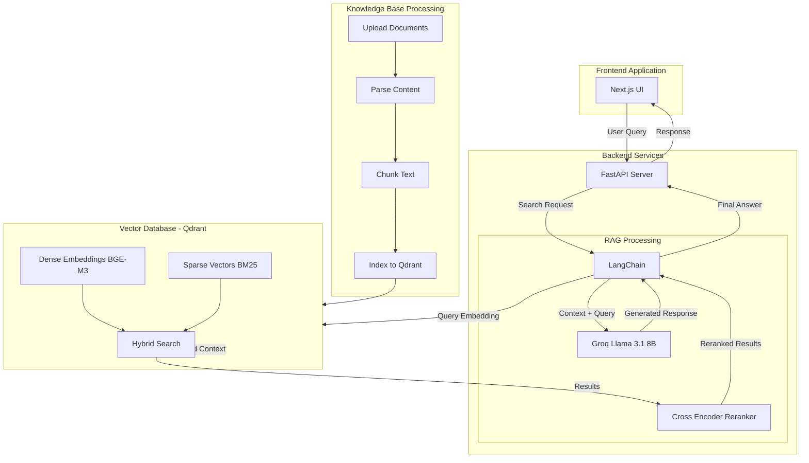

---

# From Guesswork to Governance — Automating Geo-Regulation with LLM

One-liner: Paste a product feature (title + description) → the system flags whether geo-specific compliance logic is required, explains why, and maps to laws with audit-ready provenance.

[](https://fastapi.tiangolo.com)
[](https://python.langchain.com)
[](https://groq.com)
[-4CAF50?logo=qdrant)](https://qdrant.tech)
[-5C6BC0)](https://huggingface.co/BAAI/bge-m3)
[](https://github.com/qdrant/fastembed)
[](https://www.sbert.net/examples/applications/cross-encoder/README.html)
[](https://nextjs.org)
[](https://tailwindcss.com)
[](https://www.docker.com)

## 📋 Features

- ✅ **Automated compliance detection** for product features across multiple jurisdictions
- ✅ **Multi-region legal analysis** (EU DSA, COPPA, US state laws, etc.)
- ✅ **Hybrid search** combining dense (BGE-M3) + sparse (BM25) embeddings
- ✅ **Cross-encoder reranking** for improved precision
- ✅ **Audit-ready provenance** tracking with source citations
- ✅ **Export capabilities** in JSON/CSV formats
- ✅ **Interactive web interface** built with Next.js

---

## ✅ Prerequisites
* **Python 3.10+** and **Node.js 18+**
* **Docker Desktop** (for Qdrant vector database)
* **Groq API key** (free tier available at [groq.com](https://groq.com))
* **System Requirements**: 4GB RAM, 2GB disk space
* **2 terminals** (one for API, one for Web)

---

## 🗂 Repository structure

```
TechJam/
├─ rag/ # Backend + RAG library + scripts
│ ├─ api/ # FastAPI app, Pydantic schemas, CSV utils
│ │ ├─ app.py
│ │ ├─ schemas.py
│ │ └─ utils.py
│ ├─ rag/ # LangChain components
│ │ ├─ chains.py # QA + Classify chains (Groq-backed)
│ │ ├─ prompts.py # QA / Classify prompts (JSON-safe)
│ │ ├─ retrieval.py # Qdrant hybrid retriever + optional cross-encoder rerank
│ │ ├─ qdrant_store.py # Vector store wiring (dense + sparse)
│ │ ├─ embeddings.py # BGE-M3 dense (FlagEmbedding)
│ │ ├─ heuristics.py # Rule hits + region inference
│ │ ├─ config.py # Chunking configuration
│ │ └─ chunking.py # Header-first chunking, skip References
│ ├─ scripts/
│ │ ├─ build_chunks.py
│ │ ├─ create_collection.py
│ │ ├─ index_kb.py
│ │ ├─ parse_pdf_to_txt.py
│ │ ├─ ask_cli.py
│ │ ├─ classify_cli.py
│ │ └─ run_dataset.py
│ └─ data/
│ ├─ kb_raw/ # Raw laws (.txt)
│ ├─ kb_chunks/ # Chunks (jsonl + meta.csv)
│ └─ laws_manifest.csv # File→law→region mapping
└─ web/ # Next.js frontend (App Router + Tailwind)
├─ app/
└─ components/
```

---

## 🔑 Environment variables

Backend (`TechJam/rag/.env`):

```env
QDRANT_URL=http://localhost:6333
QDRANT_API_KEY=
RAW_DIR=data/kb_raw
OUT_JSONL=data/kb_chunks/chunks.jsonl
OUT_META_CSV=data/kb_chunks/chunks.meta.csv
MANIFEST_CSV=data/laws_manifest.csv
QDRANT_COLLECTION=laws

GROQ_API_KEY=YOUR_GROQ_KEY
GROQ_MODEL=llama-3.1-8b-instant
GROQ_TEMPERATURE=0.2

ENABLE_RERANK=true
RERANK_MODEL=cross-encoder/ms-marco-MiniLM-L-6-v2

CLASSIFY_LOG_JSONL=data/classify_log.jsonl
FEEDBACK_LOG_JSONL=data/feedback.jsonl

CORS_ORIGINS=http://localhost:3000
```

Frontend (`TechJam/web/.env.local`):

```env
NEXT_PUBLIC_API_URL=http://localhost:8000
```

---

## 🧱 Setup (one-time)

### 1. Start Qdrant Database

**Linux/macOS:**
```bash
# Create storage directory and start Qdrant
mkdir -p rag/qdrant_storage
docker run -p 6333:6333 -v $(pwd)/rag/qdrant_storage:/qdrant/storage qdrant/qdrant:latest
```

**Windows (PowerShell):**
```powershell
# Create storage directory
New-Item -ItemType Directory -Force -Path "rag\qdrant_storage"
# Start Qdrant container
docker run -p 6333:6333 -v "${PWD}\rag\qdrant_storage:/qdrant/storage" qdrant/qdrant:latest
```

### 2. Backend Setup

**Linux/macOS:**
```bash
cd TechJam/rag
python -m venv .venv && source .venv/bin/activate
pip install -r requirements.txt

# Build & index KB
python scripts/build_chunks.py --raw_dir data/kb_raw --out_jsonl data/kb_chunks/chunks.jsonl --out_meta_csv data/kb_chunks/chunks.meta.csv --manifest data/laws_manifest.csv
python scripts/create_collection.py
python scripts/index_kb.py --jsonl data/kb_chunks/chunks.jsonl --collection laws --batch 128

# Run API
uvicorn api.app:app --reload --port 8000
```

**Windows (PowerShell):**
```powershell
cd .\rag
python -m venv .venv
.\.venv\Scripts\Activate.ps1
pip install -r requirements.txt

# Build & index knowledge base
python scripts\build_chunks.py --raw_dir data\kb_raw --out_jsonl data\kb_chunks\chunks.jsonl --out_meta_csv data\kb_chunks\chunks.meta.csv --manifest data\laws_manifest.csv
python scripts\create_collection.py
python scripts\index_kb.py --jsonl data\kb_chunks\chunks.jsonl --collection laws --batch 128

# Run API server
uvicorn api.app:app --reload --port 8000
```

### 3. Frontend Setup

```bash
cd TechJam/web
npm install
npm run dev
# Open http://localhost:3000
```

### 4. Verify Installation

- **Qdrant**: Visit http://localhost:6333/dashboard
- **API**: Visit http://localhost:8000/docs
- **Frontend**: Visit http://localhost:3000

---

## 🔍 Retrieval & Reranking (Quick facts)

* **Dense**: BGE-M3 via FlagEmbedding, 1024-d, cosine distance
* **Sparse**: BM25 via FastEmbedSparse, stored in Qdrant
* **Hybrid**: `QdrantVectorStore` dense+sparse combo
* **Filters**: Region filter on `metadata.region`
* **Rerank**: Cross-Encoder (`ms-marco-MiniLM-L-6-v2`), fallback lexical if disabled
* **LLM**: Groq Llama-3.1-8B-Instant, JSON-only classify

---

## 🧠 Architecture



---

## 🚀 How it works (30-second tour)

1. **Heuristics** parse feature text → detect legal cues (GH, ASL, LCP, etc.) → infer regions.
2. **Retriever** pulls law chunks from Qdrant (dense+sparse hybrid).
3. **Reranker** (cross-encoder) boosts precision.
4. **LLM Classifier** outputs strict JSON verdict: `yes|no|unclear` + reasoning + laws + provenance.
5. **Frontend** shows results, exportable as JSON/CSV.

---

