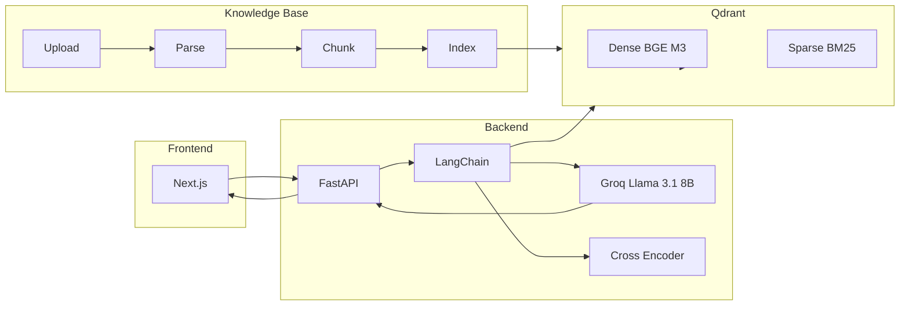

Perfect — here’s everything consolidated in **Markdown**, ready for you to copy-paste into your GitHub README.

---

# From Guesswork to Governance — Automating Geo-Regulation with LLM

One-liner: Paste a product feature (title + description) → the system flags whether geo-specific compliance logic is required, explains why, and maps to laws with audit-ready provenance.

[](https://fastapi.tiangolo.com)
[](https://python.langchain.com)
[](https://groq.com)
[-4CAF50?logo=qdrant)](https://qdrant.tech)
[-5C6BC0)](https://huggingface.co/BAAI/bge-m3)
[](https://github.com/qdrant/fastembed)
[](https://www.sbert.net/examples/applications/cross-encoder/README.html)
[](https://nextjs.org)
[](https://tailwindcss.com)
[](https://www.docker.com)

---

## 🗂 Repository structure

```
TechJam/
├─ rag/ # Backend + RAG library + scripts
│ ├─ api/ # FastAPI app, Pydantic schemas, CSV utils
│ │ ├─ app.py
│ │ ├─ schemas.py
│ │ └─ utils.py
│ ├─ rag/ # LangChain components
│ │ ├─ chains.py # QA + Classify chains (Groq-backed)
│ │ ├─ prompts.py # QA / Classify prompts (JSON-safe)
│ │ ├─ retrieval.py # Qdrant hybrid retriever + optional cross-encoder rerank
│ │ ├─ qdrant_store.py # Vector store wiring (dense + sparse)
│ │ ├─ embeddings.py # BGE-M3 dense (FlagEmbedding)
│ │ ├─ heuristics.py # Rule hits + region inference
│ │ ├─ config.py # Chunking configuration
│ │ └─ chunking.py # Header-first chunking, skip References
│ ├─ scripts/
│ │ ├─ build_chunks.py
│ │ ├─ create_collection.py
│ │ ├─ index_kb.py
│ │ ├─ parse_pdf_to_txt.py
│ │ ├─ ask_cli.py
│ │ ├─ classify_cli.py
│ │ └─ run_dataset.py
│ └─ data/
│ ├─ kb_raw/ # Raw laws (.txt)
│ ├─ kb_chunks/ # Chunks (jsonl + meta.csv)
│ └─ laws_manifest.csv # File→law→region mapping
└─ web/ # Next.js frontend (App Router + Tailwind)
  ├─ app/
  └─ components/
```

---

## ✅ Prerequisites

* Python 3.10+ and Node 18+
* Docker (for Qdrant)
* Groq API key (free tier works)
* 2 terminals (one for API, one for Web)

---

## 🔑 Environment variables

Backend (`TechJam/rag/.env`):

```env
QDRANT_URL=http://localhost:6333
QDRANT_API_KEY=
RAW_DIR=data/kb_raw
OUT_JSONL=data/kb_chunks/chunks.jsonl
OUT_META_CSV=data/kb_chunks/chunks.meta.csv
MANIFEST_CSV=data/laws_manifest.csv
QDRANT_COLLECTION=laws

GROQ_API_KEY=YOUR_GROQ_KEY
GROQ_MODEL=llama-3.1-8b-instant
GROQ_TEMPERATURE=0.2

ENABLE_RERANK=true
RERANK_MODEL=cross-encoder/ms-marco-MiniLM-L-6-v2

CLASSIFY_LOG_JSONL=data/classify_log.jsonl
FEEDBACK_LOG_JSONL=data/feedback.jsonl

CORS_ORIGINS=http://localhost:3000
```

Frontend (`TechJam/web/.env.local`):

```env
NEXT_PUBLIC_API_URL=http://localhost:8000
```

---

## 🧱 Setup (one-time)

```bash
# Start Qdrant
docker run -p 6333:6333 -v $(pwd)/rag/qdrant_storage:/qdrant/storage qdrant/qdrant:latest

# Backend
cd TechJam/rag
python -m venv .venv && source .venv/bin/activate
pip install -r requirements.txt

# Build & index KB
python scripts/build_chunks.py --raw_dir data/kb_raw --out_jsonl data/kb_chunks/chunks.jsonl --out_meta_csv data/kb_chunks/chunks.meta.csv --manifest data/laws_manifest.csv
python scripts/create_collection.py
python scripts/index_kb.py --jsonl data/kb_chunks/chunks.jsonl --collection laws --batch 128

# Run API
uvicorn api.app:app --reload --port 8000
```

Frontend:

```bash
cd TechJam/web
npm i
npm run dev
# open http://localhost:3000
```

---

## 🔍 Retrieval & Reranking (Quick facts)

* **Dense**: BGE-M3 via FlagEmbedding, 1024-d, cosine distance
* **Sparse**: BM25 via FastEmbedSparse, stored in Qdrant
* **Hybrid**: `QdrantVectorStore` dense+sparse combo
* **Filters**: Region filter on `metadata.region`
* **Rerank**: Cross-Encoder (`ms-marco-MiniLM-L-6-v2`), fallback lexical if disabled
* **LLM**: Groq Llama-3.1-8B-Instant, JSON-only classify

---

## 🧠 Architecture



---

## 🚀 How it works (30-second tour)

1. **Heuristics** parse feature text → detect legal cues (GH, ASL, LCP, etc.) → infer regions.
2. **Retriever** pulls law chunks from Qdrant (dense+sparse hybrid).
3. **Reranker** (cross-encoder) boosts precision.
4. **LLM Classifier** outputs strict JSON verdict: `yes|no|unclear` + reasoning + laws + provenance.
5. **Frontend** shows results, exportable as JSON/CSV.

---

## 🧪 Demos

* `/` — Paste feature → Analyze → JSON/CSV
* `/search` — See raw law snippets (auditability)
* `/demo` — What-if sandbox: “Assume region” override

---

## 🛠 Troubleshooting

* **Empty results**: ensure Qdrant running + collection exists.
* **Region filters**: fallback to broader retrieval if no hits.
* **Delete didn’t work**: retry; delete is idempotent.
* **Full reindex**: drop collection, recreate, reindex.

---

Do you want me to also add a **“Demo flow checklist”** (like a 1–2 min judge-friendly walkthrough you can read aloud during the presentation)?
